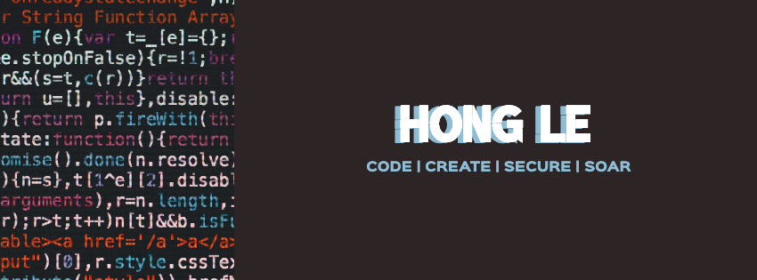

## 👋👩‍💻 **About Me**
Greetings, mission breifing begins now! Hi, I'm **Hong Le**, a software engineer passionate about creating software solutions, securing cyberspace, and exploring aerospace. Currently pursuing my OMSCS at Georgia Tech, I aim to blend cutting-edge software with real-world impact.

Fun fact? I'm a pilot-in-training with an unwavering 100% arm-wrestling win rate! 😎

## 📍 **Current Focus**:
- 🔭 **Building**: [Venues & Estates](#) & [hongcodes.com](https://hongcodes.com)  
- 🌱 **Learning**: artificial intelligence, machine learning, real-time systems, GIS, maps & satellites
- 💭 **Dreaming of**: Combining everything with software for innovative solutions  

## 🚀 **My Tech Stack**:
- ### **Languages & Frameworks**:
 

    
  

- ### **Data & Machine Learning**:
 

    
  

- ### **Tools & Platforms**:
 

    
  

<!-- 
## 🏆 **Achievements** 

## 📚 **Featured Projects**  
-->

## 🌈 Behind the Code -- Get to Know Me 

Hello world! 🌎 I'm **Hong Le** (she/her), a dreamer disguised as a coder, blending creativity, logic, and just a touch of madness to turn ideas into reality (and bugs into... smaller bugs?). I dabble in a bit of everything because sticking to one thing feels way too mainstream. Indecisiveness? Let's just call it versatility. Whether it's building slick software, securing cyberspace, or dreaming about soaring through the clouds as a pilot, I tackle challenges with a smile, a bit of sarcasm, and maybe a bad pun or two.  

But that's just one side of me. The other? Well...

I am a **professional procrastinator**, excelling at doing absolutely nothing in the most spectacular way imaginable. Sometimes, I'm an overzealous, impulsive, **megalomaniacal** human convinced of my own greatness — other times, just your average **existential crisis in a hoodie**.  

Long ago, I was the metaphysical embodiment of **rainbows and happiness**, an unseen spirit drifting through the winds. That was until I got captured by humans, grounded to reality, and tasked with making people laugh and smile. Fun fact: those same laughs and smiles are now powering a mega mech that will _probably_ obliterate Earth someday. But for now, yay! **Rainbows!!** 🌈  

As a part-time **sky-gazer** and a full-time **creative chaos engineer**, I wield my keyboard and over-caffeinated imagination to bring wild ideas to life. If you're into **tech**, **anarchy**, or **bad puns**, we're probably going to get along just fine. Let's connect and make something awesome together! 🚀

## 💬 **Let's Connect** 
- **LinkedIn:** [Connect Here](www.linkedin.com/in/honglebs)
- **Email:** [hong.le@hongcodes.com](mailto:hong.le@hongcodes.com) || [hongle.codes@gmail.com](mailto:hongle.codes@gmail.com)
- **Portfolio:** [hongcodes.com](https://hongcodes.com)  
- **Discord:** [Wanna VC?](https://discord.gg/VHAxAFfC)
- **Steam:** [PC GAMER?!](https://s.team/p/ghfj-cngq/KJJTNGHC)
- **Insta:** [Let's be friends!](https://www.instagram.com/livin_hong/)

## 📊 GitHub Stats

  <table>
    <tr>
      <td>
        
      </td>
      <td>
        
      </td>
    </tr>
    <tr>
      <td colspan="2" align="center">
        
        
      </td>
    </tr>
  </table>

